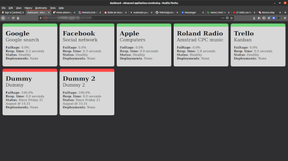

# Protocol/7

Protocol/7 (P7) is an Open Source GPLv3 web monitoring system that can:

- Generate a nice HTML dashboard showing the status of your web apps,
- Control a BlinkStick USB RGB LED light that changes color depending on the condition of your services,
- Send messages and alerts to Slack,
- Send its logs to Sumologic,
- Communicate with you via a ex-Anki / Digital Dream Labs Cozmo robot,
- Monitor your mailbox.

## Presentation

### Where does the name come from ?

*Protocol Seven* is a central piece in the 1998 [*Serial Experiments Lain*](https://en.wikipedia.org/wiki/Serial_Experiments_Lain) Japanese anime TV series. In a nutshell, it's a network protocol designed by *Masami Eiri* that allow people to use a natural phenomenon known as the *Schumann resonances* to connect to the *Wired* (an enhanced Internet) directly without a computer, by using a microchip interface called the *Psyche chip*.

*Masami Eiri* illicitly included a backdoor enabling him to control the whole system at will and embedded his own mind into the network. Because of this, he was fired by *Tachibana General Laboratories*, and was found dead not long after. He believes that the only way for humans to evolve even further and develop even greater abilities is to absolve themselves of their physical and human limitations, and to live as virtual entities — or avatars — in the *Wired* for eternity.

### The dashboard



Protocol/7 dashboard is made of cards (one per monitored URL) and shows the following info:

- Application name & environment,
- Failtage: failure percentage over the last 6 test cycles,
- Response time in seconds over the last 6 test cycles,
- The status of the service, with the time and date of the current failure if required,
- A link to the current deployment job (in Azure DevOps).

This dashboard is generated by Protocol/7 and can be automatically stored on Azure Blob Storage and/or AWS S3 bucket.

### BlinkStick USB RGB LED light

Protocol/7 can control one or more BlinkStick USB RGB LED light. The models currently supported are [BlinkStick Nano](https://www.blinkstick.com/products/blinkstick-nano) and [BlinkStick Flex](https://www.blinkstick.com/products/blinkstick-flex).

You need to setup [p7devices](https://github.com/TME520/p7devices) in order to enable a BlinkStick on your local laptop/desktop computer.

## Setup

### Deploy a Protocol/7 stack in AWS

#### Prerequisites

1. You need a AWS account. You can create one for free and you can use some resources for free too,
2. You need a Sumologic account. You can also create one for free,
3. You need a Slack workspace. You can create one for free too,
4. You need a BlinkStick. These must be ordered from UK [here](https://www.blinkstick.com/),
5. The deployment must be triggered from Jenkins.

#### Preparation

1. Clone [my Jenkins repo](https://github.com/TME520/jenkinslab) and [my CloudFormation repo](https://github.com/TME520/cloudformation),
2. Setup your own [Jenkins](https://www.jenkins.io/),
3. Create a Jenkins pipeline named `prepareP7ParamsFile`,
4. In the Jenkins home directory (usually /var/lib/jenkins), locate its `config.xml` file (should be `/var/lib/jenkins/jobs/prepareP7ParamsFile/config.xml`) and [update it with this content](https://github.com/TME520/jenkinslab/blob/master/declarative/prepareP7ParamsFile.config.xml),
5. Create another Jenkins pipeline named `deployProtocol7`,
6. In the Jenkins home directory, locate its `config.xml` file and [update it with this content](https://github.com/TME520/jenkinslab/blob/master/declarative/deployProtocol7.config.xml),
7. Time to configure some credentials: `slack_token` (secret text), `sumo_endpoint` (secret text) and `aws_access_key` (username with password).

#### Deployment

1. Run Jenkins pipeline `prepareP7ParamsFile` and wait for it to complete,
2. Go to the AWS console, CloudFormation | Outputs and keep note of the information displayed there.

### Protocol/7 Docker image

N/A

### Run Protocol/7 locally

1. Download and install [AWS DynamoDB](https://docs.aws.amazon.com/amazondynamodb/latest/developerguide/DynamoDBLocal.DownloadingAndRunning.html),
2. Install OpenJDK

```
$ apt install openjdk-14-jre
```

3. Install AWS CLI

```
$ apt install awscli
```

4. Configure AWS access (required even for local DynamoDB)

`$ aws configure`

```
[default]
aws_access_key_id = AAAABBBBCCCCDDDD
aws_secret_access_key = EEEEFFFFGGGGHHHH
region = ap-southeast-2
```

5. Check your config

```
$ aws configure list
```

6. Start DynamoDB

`nohup java -Djava.library.path=./DynamoDBLocal_lib -jar DynamoDBLocal.jar -port 8001 > foo.out 2> foo.err < /dev/null &`

7. Install Python3

`$ apt install build-essential libssl-dev libffi-dev python3 python3-pip python3-dev python3-venv python3-pil.imagetk`

8. Install Python pip and some modules

`pip3 install --upgrade pip`

`pip3 install pymsteams cozmo exchangelib slackclient blinkstick sklearn pandas nltk joblib argparse boto3 colorama notify2 azure-storage-blob azure-mgmt-compute azure-mgmt-storage azure-mgmt-resource azure-keyvault-secrets azure-storage-blob requests_toolbelt requests azure-devops msrest`

`pip3 install --user 'cozmo[camera]'`

9. Clone the Protocol/7 repository

`git clone https://github.com/TME520/protocol7.git`

10. Create a startup file and follow the configuration instructions from the README file

```
cd ./protocol7/
cp -pv ./startTemplate.sh.template ./startProtocol7.sh
chmod +x ./startProtocol7.sh
```

11. Start Protocol/7

`nohup ./startProtocol7.sh > foo.out 2> foo.err < /dev/null &`

12. Clone the Persona/7 repository

`git clone https://github.com/TME520/persona7.git`

13. Create a startup file and follow the configuration instructions from the README file

```
cd ./persona7/
cp -pv ./startTemplate.sh.template ./startPersona7.sh
chmod +x ./startPersona7.sh
```

14. Start Persona/7

`nohup ./startPersona7.sh > foo.out 2> foo.err < /dev/null &`

15. Clone the p7devices repository

`git clone https://github.com/TME520/p7devices.git`

16. Create a startup file and follow the configuration instructions from the README file

```
cd ./p7devices/bstick_nano/
cp -pv ./startBStick.sh.template  ./startBStick.sh
chmod +x ./startBStick.sh
```

17. Start BlinkStick

### Deploy a Protocol/7 stack in Azure

N/A

### Deploy a Protocol/7 stack in Google Cloud

N/A

## Configuration

In this section, I will explain every configuration file field.

### startProtocol7.sh

During installation, you created the file *startProtocol7.sh* as follows:

`cp -pv ./startTemplate.sh.template ./startProtocol7.sh`

This Bash script exports environment variables that will be used by Protocol/7. Refer to the Code field in order to know if single quotes are required or not. If you want to leave a field empty, simply use empty single quotes. If the field requires a number, just use a default value like 0 (OFF).

| Field | Code | Purpose | Example |
| --- | --- | --- | --- |
| NAME | SED001 | Name of the Protocol/7 instance | 'Skynet' |
| CLIENT | SED002 | Name of the client this instance is used for | 'World Company' |
| ENV | SED003 | Environment being monitored | 'PROD' | 
| PROJECT | SED004 | Project being monitored | 'Pink Papadum' |
| SLACKTOKEN | SED005 | Token used to access Slack | 'AAABBBCCCDDDEEEFFF' |
| AZSTORACCNAME | SED006 | Azure Storage Account name. Used to store the HTML files of the dashboards. | 'Mithrandir' |
| AZSTORACCKEY | SED007 | Access key for the Azure Storage Account mentioned above | 'AAABBBCCCDDDEEEFFF' |
| AZCNXSTRING | SED037 | Connection string for the ASA mentioned above | 'DefaultEndpointsProtocol=https;AccountName=Mithrandir;AccountKey=AAABBBCCCEEE==;EndpointSuffix=core.windows.net'
| NTAPIUSER | SED008 | Unused; I will remove it once I'm sure all associated code has been disabled | N/A |
| NTAPIPASS | SED009 | Unused; I will remove it once I'm sure all associated code has been disabled | N/A |
| AZDEVOPSPAT | SED010 | Personal Access Token for Azure DevOps | 'AAABBBCCCDDDEEEFFF' |
| SUMOENDPOINT | SED011 | HTTPS endpoint used to ship logs to Sumologic | 'https://foobar.meh' |
| AWS_ACCESS_KEY_ID | SED033 | Access key for AWS CLI | 'AAABBBCCCDDDEEEFFF' |
| AWS_SECRET_ACCESS_KEY | SED034 | Password associated with your AWS access key | 'AAABBBCCCDDDEEEFFF' |
| AWS_DEFAULT_REGION | SED035 | AWS region to use by default | 'ap-southeast-2' |
| MSTEAMSWEBHOOK | SED039 | Webhook used to interact with MS Teams | 'https://foobar.meh' |
| DYNAMODBURL | SED012 | DynamoDB is used mainly for information exchange between remote components of Protocol/7. A weird choice, I know. | 'http://localhost:8001' |
| CB1DATAFOLDER | SED013 | CB1 means "Chat Bot 1", the old name for Persona/7 | './cb1data/' |
| DASHBOARDFILENAME | SED014 | Name of the HTML file for the simple dashboard | 'onedash-apps-monitoring-foo-bar-prod.html' | 
| ADVDASHBOARDFILENAME | SED015 | Name of the HTML file for the advanced dashboard | 'onedash-apps-monitoring-advanced-foo-bar-prod.html' |
| DASHBOARDSBASEURL | SED016 | URL giving access to the dashboards. No need for a trailing slash. | 'https://foobar.meh' |
| AZDEVOPSURL | SED017 | URL giving access to Azure DevOps | 'https://dev.azure.com/Legion' |
| LOGSFOLDER | SED018 | This folder will contain the logs produced by Protocol/7 | './log/' |
| LOGFILENAME | SED019 | The name of the log file | 'p7-foo-bar-prod.log' |
| CONFIGFILE | SED020 | The config file contains the URLs monitored by Protocol/7 | 'foo_bar_prod_config' |
| NTSEARCHURL | SED021 | Unused; I will remove it once I'm sure all associated code has been disabled | N/A |
| NTLOGINURL | SED022 | Unused; I will remove it once I'm sure all associated code has been disabled | N/A |
| S3BUCKETNAME | SED030 | Name of the AWS S3 bucket used to store the HTML files of the dashboards | 'Mithrandir' |
| ENABLELOCALBSTICK | SED023 | Drive the Blinkstick locally (0=NO 1=YES) | 0 |
| ENABLEREMOTEBSTICK | SED036 | Drive the Blikstick remotely (0=NO 1=YES). This implies that an instance of *p7devices* is running on a remote server. | 0 |
| ENABLESLACK | SED024 | Publish messages to Slack (0=NO 1=YES) | 0 |
| ENABLESUMO | SED025 | Send logs to Sumologic (0=NO 1=YES) | 0 |
| ENABLEDASH | SED026 | Make the dashboards available or not (0=NO 1=YES) | 0 |
| AZDASHENABLED | SED031 | Host the dashboards HTML files on an Azure Account Storage (0=NO 1=YES) | 0 |
| AWSDASHENABLED | SED032 | Host the dashboards HTML files on a  AWS S3 bucket (0=NO 1=YES) | 0 |
| ENABLEMSTEAMS | SED038 | Publish messages to MS Teams (0=NO 1=YES). The target channel is defined by the webhook used. | 0 |

### sample_config.py

This file contains the URLs that will be monitored by Protocol/7. It's not included in *startProtocol7.sh* because it's in fact a Python source file.

| Field | Purpose | Example |
| --- | --- | --- |
| emptyCreds | Do not change that value, these are dummy creds used by Protocol/7 internally | { 'foo' : 'bar' } |
| urlList | The URLs that will be monitored by Protocol/7. Fields detailed under this table. | N/A | 
| ntAPICountriesList | Unused; I will remove it once I'm sure all associated code has been disabled | {} |

#### Details of the urlList fields

| Field | Purpose | Example |
| --- | --- | --- |
| appname | Nickname for the URL | 'Google' |
| customer | What the URL is used for | 'Google search' |
| url | The URL itself | 'https://www.google.com' |
| credentials | Credentials used to access the URL | emptyCreds |
| payload | Data to be POSTed to the URL | 'EMPTY' |
| failure_history | Internal Protocol/7 data (0 means success, 1 means failure). Do not change. | [0,0,0,0,0,0] |
| rt_history | Response time history. Internal Protocol/7 data, do not change. | [0,0,0,0,0,0] |
| orange_since | Internal Protocol/7 data, do not change | '-' |
| red_since | Internal Protocol/7 data, do not change | '-' |
| orange_sent | Internal Protocol/7 data, do not change. | 0 |
| red_sent | Internal Protocol/7 data, do not change | 0 |
| release_def_ids | Definition IDs related to that URL/Service in Azure DevOps. Used to track deployments. | [0] |
| latest_deployment | Latest deployment for related IDs in Azure DevOps | 'None' |
| protocol | Protocol used to access the URL (HTTP,HTTPS) | 'HTTPS' |
| retries | Number of attempts at reaching the URL | 3 |
| timeout | Time out in seconds for an attempt at reaching the URL | 10 |
| http_success | HTTP return codes considered as success | [200,301,302] |
| http_failure | HTTP return codes considered as failures | [400,401,404,500] |
| http_maintenance | HTTP return codes indicating the target URL/Service is in maintenance mode | [307,503] |
| payload_success | Payload retrieved from the URL that is considered as success | 'Feeling Lucky' |
| payload_maintenance | Payload retrieved from the URL that indicates it's under maintenance | 'maintenance' |
| payload_failure | Payload retrieved from the URL that is considered as failure | 'error' |
| flappingCntr | Internal Protocol/7 data, do not change | 0 |
| flappingStatus | Internal Protocol/7 data, do not change | 0 |
| previousStatus | Internal Protocol/7 data, do not change | 'None' |
| currentStatus | Internal Protocol/7 data, do not change | 'None' |
| ack | Internal Protocol/7 data, do not change | '19700101' '
| runbook | Runbook to follow in order to fix the issue causing downtime | 'https://documentation.com/foobar/fixit.html#PEBKAC' |

## Usage

### Dashboard statuses

| HTTP status | Deployment | Failures counter | Color | Status |
| --- | --- | --- | --- | --- |
| success | None | - | green | UP |
| success | Yes | - | light blue | UP |
| maintenance | None | - | yellow | MAINTENANCE |
| maintenance | Yes | - | light blue | UP |
| failure 666 (URLERROR) | None | 1 | green | UP - Last test failed |
| failure 666 (URLERROR) | Yes | 1 | green | UP - Check for deployment |
| failure 777 (INETERROR) | - | 1 | grey | INET CNX ISSUE |
| failure 401 (HTTPERROR) | - | 1 | pink | CREDS ISSUE |
| failure 999 (OTHERERROR) | - | 1 | grey | OTHER ISSUE |
| failure (OTHERERROR) | - | 1 | grey | UNMANAGED ISSUE |
| failure User Defined | None | 1 | green | UP - Last test failed |
| failure User Defined | Yes | 1 | green | UP - Check for deployment |
| failure 666 (URLERROR) | None | 2-5 | orange | INCIDENT |
| failure 666 (URLERROR) | Yes | 2-5 | orange | INCIDENT - Check for deployment |
| failure 777 (INETERROR) | - | 2-5 | grey | INET CNX ISSUE |
| failure 401 (HTTPERROR) | - | 2-5 | pink | CREDS ISSUE |
| failure 999 (OTHERERROR) | - | 2-5 | grey | OTHER ISSUE |
| failure (OTHERERROR) | - | 2-5 | grey | UNMANAGED ISSUE |
| failure User Defined | None | 2-5 | orange | INCIDENT |
| failure User Defined | Yes | 2-5 | orange | INCIDENT - Check for deployment |
| failure 666 (URLERROR) | None | 6+ | red | DOWN |
| failure 666 (URLERROR) | Yes | 6+ | red | DOWN - Check for deployment |
| failure 777 (INETERROR) | - | 6+ | grey | INET CNX ISSUE |
| failure 401 (HTTPERROR) | - | 6+ | pink | CREDS ISSUE |
| failure 999 (OTHERERROR) | - | 6+ | grey | OTHER ISSUE |
| failure (OTHERERROR) | - | 6+ | grey | UNMANAGED ISSUE |
| failure User Defined | None | 6+ | red | DOWN |
| failure User Defined | Yes | 6+ | red | DOWN - Check for deployment |
